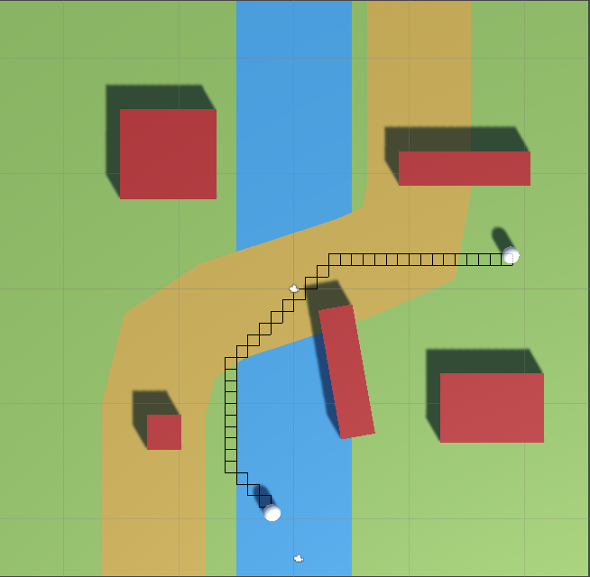

# A* Pathfinding

A* Pathfinding implementation in Unity3D as well as an online tool to help understanding the algorithm.

<p align="center">
</p>


## Getting Started

```batch
git clone https://github.com/SarangMohaniraj/AStarPathfinding.git
```

## Usage

To see the path in the Unity Editor, make sure Gizmos is enabled.

The inspector has various customization attributes on the A* GameObject. Grid size and node radius control the size and location of the grid, and the density of the nodes. A smaller node radius increases the number of nodes and accuracy of the search; however, there is a tradeoff: it also increases the search time. Be sure to line up the grid with the plane using the Gizmos, as the node radius and grid size will change the location of the grid. I recommend maintaining the same proportions as the plane (10 times as much as its scale) and using a node radius of 0.5 for the best grid. Select your obstacle layer for the unwalkable mask so the seeker does not walk over that region. Choose the amount of walkable regions your game contains and add a layer as the terrain mask and a number for the movement penalty. A movement penalty of 0 is "normal" and anything higher may cause the seeker to avoid that type of terrain. The movement penalty also affects the movement speed, but you can change the formula that determines the speed.

Drag the seeker and the target into the A* GameObject. If you activate the stopwatch, the console will log the time it takes to find a path. Like I said before, the complexity of the A* search determines on various factors such as grid size, the node radius, the distance between the seeker and the target, and the position of the A* GameObject.

A min-heap greatly reduces complexity for A* search. C# does not natively support the heap data structure, but it is not too difficult to code yourself.

This is the computationally straining block of code. To implement heaps, replace this:

```c#
List<Node> openSet = new List<Node>(); //nodes to be evaluated


Node lowestCost = openSet[0];
for(int i = 1; i < openSet.Count; i++)
{
    if (openSet[i].fCost < lowestCost.fCost || (openSet[i].fCost == lowestCost.fCost && openSet[i].hCost < lowestCost.hCost) ) //if fCost is the same, compare hCost
        lowestCost = openSet[i];
}
openSet.Remove(lowestCost);
```
with

```c#
Heap<Node> openSet = new Heap<Node>(grid.gridSizeX * grid.gridSizeY);


Node lowestCost = openSet.RemoveFirst();
```

Have fun moving around the seeker or the target to see the path recalculate. You can also test out different movement penalties to see different scenarios.

## License

This project is licensed under the MIT License - see the [LICENSE.md](LICENSE.md) file for details


## Acknowledgments

http://theory.stanford.edu/~amitp/GameProgramming/Heuristics.html#heuristics-for-grid-maps